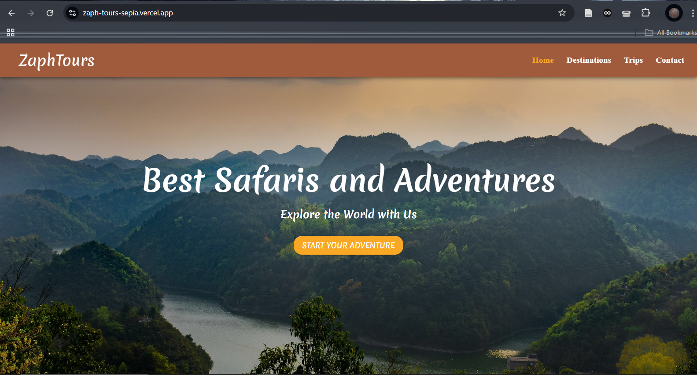

# Zaph Tours

An appealing travel website built using **React** and **Material UI**, showcasing exciting destinations, trip packages, and an easy-to-use contact form with an interactive map.

It is designed to help users explore travel destinations, trip types, and contact the travel agency. 

### Features

- **Destinations Page** – View all featured travel locations with details and pricing.
- **Trip Types Page** – Explore packages like honeymoons, safaris, family tours, etc.
- **Contact Page** – Includes a contact form, office hours, company info, and an embedded map.
- **Responsive Drawer Navigation** – Works well on mobile and desktop without overcomplicating logic.
- **Custom Theming** – Includes a consistent color palette and font styling using MUI's theme system.

## Built With
- React
- Material UI (MUI)

